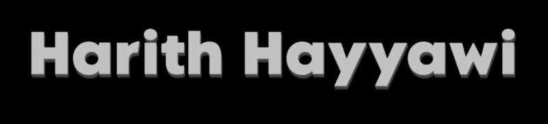

  

### Hi there 👋
---
I'm a Computer Science and Cybersecurity student, passionate about programming, cybersecurity, and building meaningful programming projects.

<!-- * 🔭 I’m currently working on [UniBites](https://unibites.app) & Security+ -->
* 💡 Interests: Cybersecurity, backend development, low-level programming, and automation
* 📝 Blog: Sharing my journey and projects in development and cybersecurity
* 🤝 I’m looking to collaborate on open-source projects

### 📚 My Portfolio
---

### 📬 Reach me at

<!-- ### Skills -->
<!-----### Top Projects-->

<!-----### Cybersecurity Projects/Labs-->
---

<!---->

